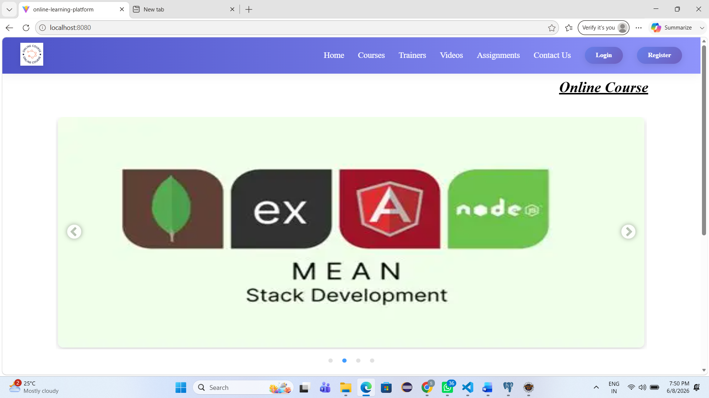
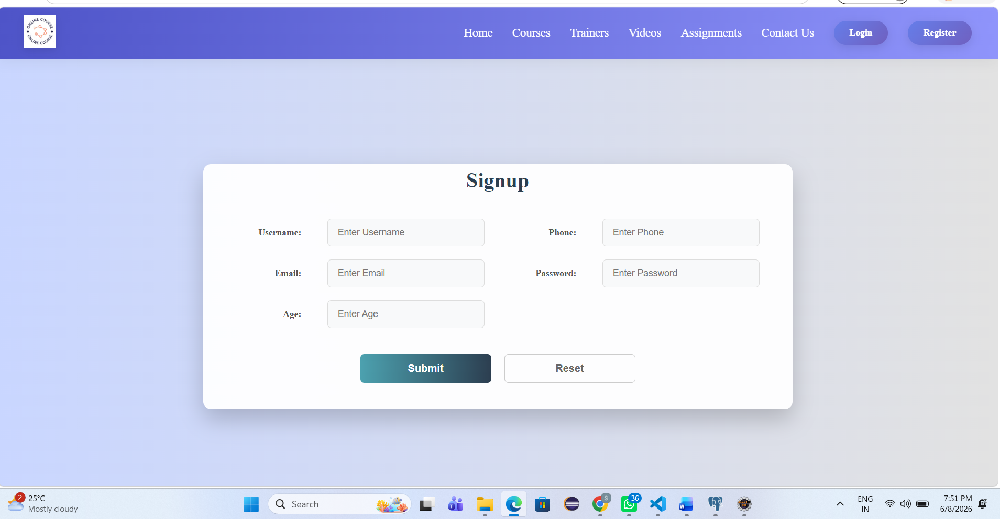
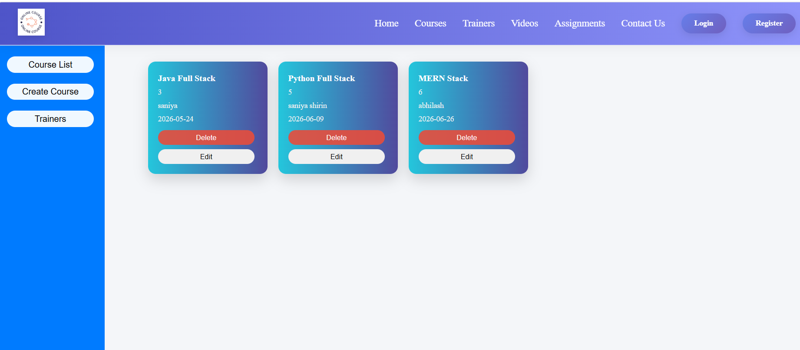
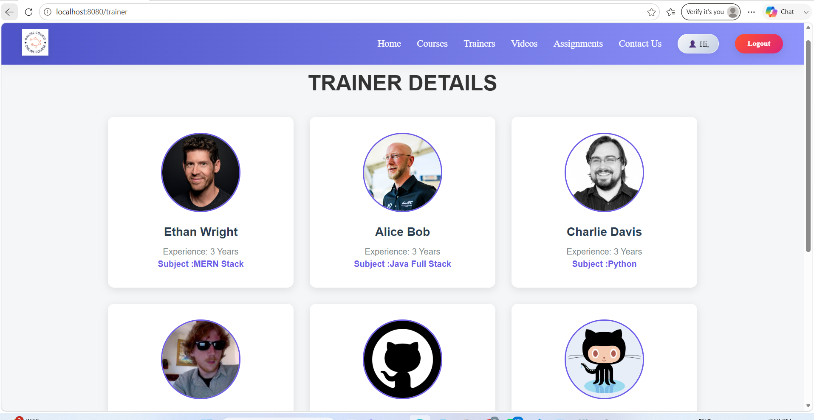
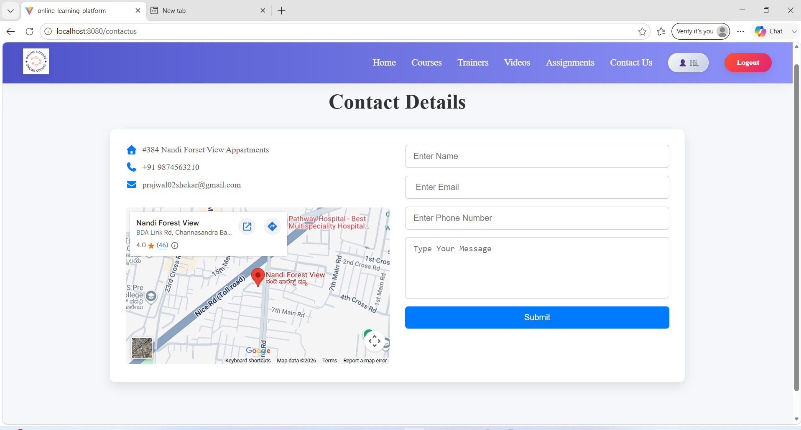
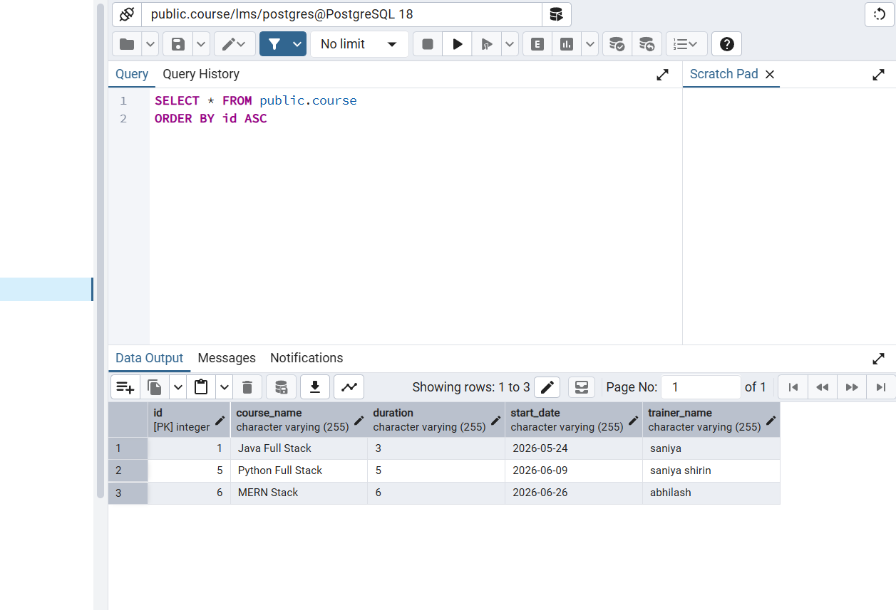

# online-learning-platform-application
A full-stack Online Learning Platform developed using Java Spring Boot, HTML, CSS, JavaScript, and MySQL. The system enables user authentication, course management, trainer management, video learning, and assignment handling.

## Features

- User Registration & Login
- Course Management
- Trainer Management
- Assignment Management
- Learning Resources
- Responsive User Interface

## Technologies Used

- Java
- Spring Boot
- React.js
- Vite
- HTML
- CSS
- JavaScript
- MySQL
- Maven

## Project Structure

```text
online-learning-platform/
├── src/
├── frontend/
├── pom.xml
└── README.md
```

## Run the Project

### Backend
```bash
mvn spring-boot:run
```

### Frontend
```bash
cd frontend
npm install
npm run dev
```

## Project Screenshots

### Home Page


### Signup Page


### Courses Page


### Trainers Details


### Assignment Page


### Contact Page


### Database


## Author

**Saniya Shirin**
